<!-- AOC TILES BEGIN -->
<h1 align="center">
  Advent of Code - 122/522 ⭐
</h1>
<h1 align="center">
  2025 - 22 ⭐ - TypeScript
</h1>
<a href="src/2025/day1.ts">
  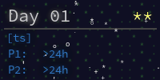
</a>
<a href="src/2025/day2.ts">
  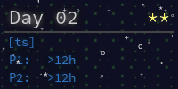
</a>
<a href="src/2025/day3.ts">
  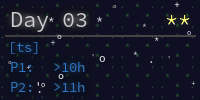
</a>

<a href="src/2025/day5.ts">
  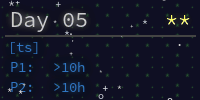
</a>
<a href="src/2025/day6.ts">
  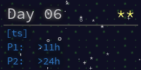
</a>
<a href="src/2025/day7.ts">
  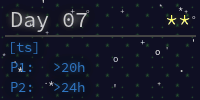
</a>
<a href="src/2025/day8.ts">
  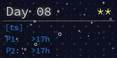
</a>
<a href="src/2025/day9.ts">
  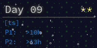
</a>
<a href="src/2025/day10.ts">
  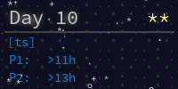
</a>
<a href="src/2025/day11.ts">
  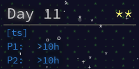
</a>
<h1 align="center">
  2024 - 50 ⭐ - TypeScript
</h1>
<a href="src/2024/day1.ts">
  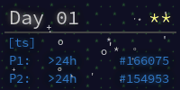
</a>
<a href="src/2024/day2.ts">
  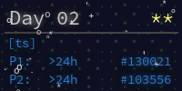
</a>
<a href="src/2024/day3.ts">
  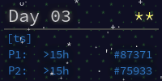
</a>
<a href="src/2024/day4.ts">
  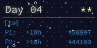
</a>
<a href="src/2024/day5.ts">
  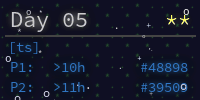
</a>
<a href="src/2024/day6.ts">
  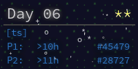
</a>
<a href="src/2024/day7.ts">
  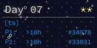
</a>
<a href="src/2024/day8.ts">
  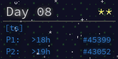
</a>

<a href="src/2024/day10.ts">
  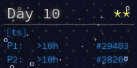
</a>
<a href="src/2024/day11.ts">
  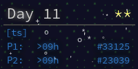
</a>
<a href="src/2024/day12.ts">
  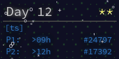
</a>
<a href="src/2024/day13.ts">
  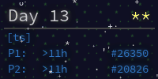
</a>
<a href="src/2024/day14.ts">
  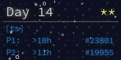
</a>

<a href="src/2024/day16.ts">
  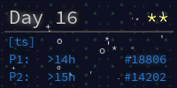
</a>
<a href="src/2024/day17.ts">
  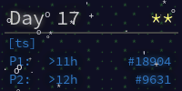
</a>
<a href="src/2024/day18.ts">
  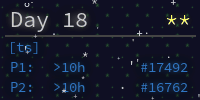
</a>
<a href="src/2024/day19.ts">
  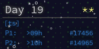
</a>
<a href="src/2024/day20.ts">
  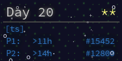
</a>
<a href="src/2024/day21.ts">
  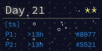
</a>
<a href="src/2024/day22.ts">
  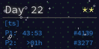
</a>
<a href="src/2024/day23.ts">
  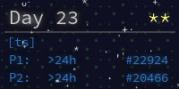
</a>
<a href="src/2024/day24.ts">
  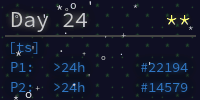
</a>
<a href="src/2024/day25.ts">
  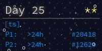
</a>
<h1 align="center">
  2023 - 50 ⭐ - TypeScript
</h1>
<a href="src/2023/day1.ts">
  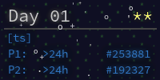
</a>
<a href="src/2023/day2.ts">
  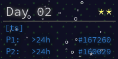
</a>
<a href="src/2023/day3.ts">
  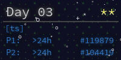
</a>
<a href="src/2023/day4.ts">
  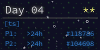
</a>
<a href="src/2023/day5.ts">
  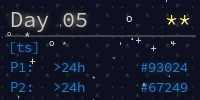
</a>
<a href="src/2023/day6.ts">
  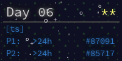
</a>
<a href="src/2023/day7.ts">
  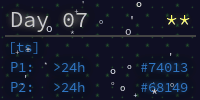
</a>
<a href="src/2023/day8.ts">
  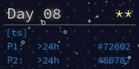
</a>
<a href="src/2023/day9.ts">
  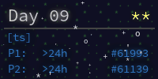
</a>
<a href="src/2023/day10.ts">
  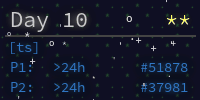
</a>
<a href="src/2023/day11.ts">
  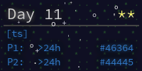
</a>
<a href="src/2023/day12.ts">
  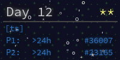
</a>
<a href="src/2023/day13.ts">
  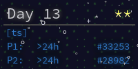
</a>

<a href="src/2023/day15.ts">
  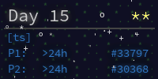
</a>
<a href="src/2023/day16.ts">
  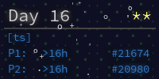
</a>
<a href="src/2023/day17.ts">
  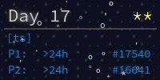
</a>
<a href="src/2023/day18.ts">
  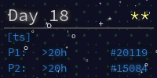
</a>

<!-- AOC TILES END -->

## Note:

- For linear equations use Cramer's rule

---
